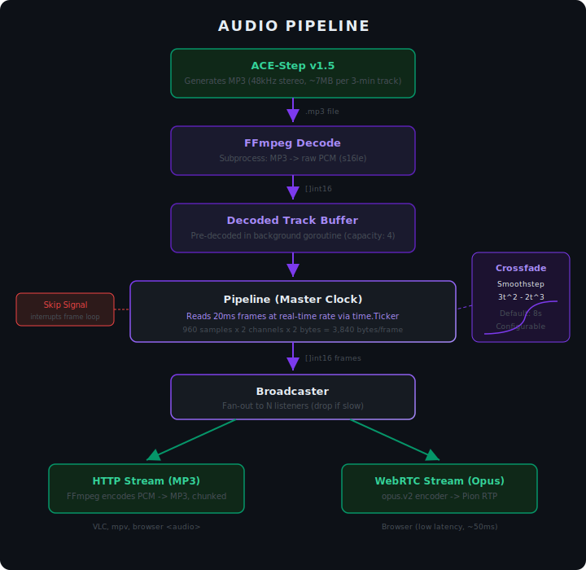
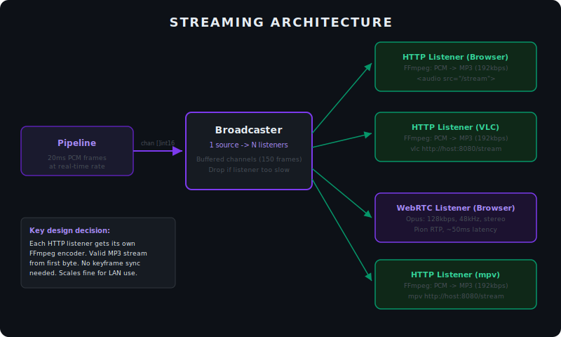
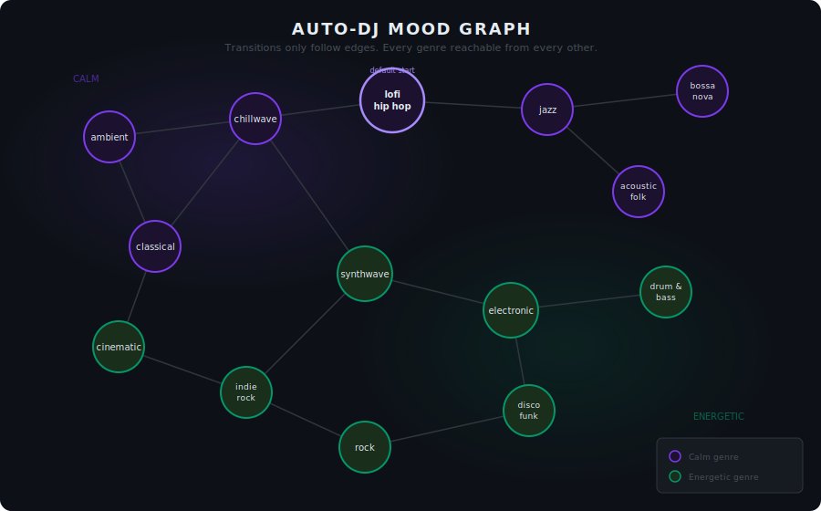

# drift (codename)

Self-hosted AI radio station that generates infinite music with smooth genre transitions. Runs on your GPU, streams to your browser.

<p align="center">
  
</p>

## What It Does

- Generates AI music continuously using [ACE-Step v1.5](https://github.com/ace-step/ACE-Step-1.5)
- Auto-DJ walks a 14-genre mood graph -- ambient drifts into chillwave, chillwave into lofi, lofi into jazz
- Smoothstep crossfades between tracks (18s default, no silence, no jarring cuts)
- LLM-powered captions, track names, and structure tags via [Ollama](https://ollama.com/) (optional)
- Stream to any device on your LAN -- browser, VLC, mpv
- Dark mode web UI with genre controls, skip, ratings, and prompt/lyrics display
- HTTP chunked MP3 stream (universal) + WebRTC Opus (low-latency)

## Quick Start

```bash
git clone https://github.com/satindergrewal/InfiniteRadio.git
cd InfiniteRadio
docker compose up --build
```

Open `http://<your-server-ip>:8080` in your browser. Hit play.

Or stream directly in VLC:
```bash
vlc http://<your-server-ip>:8080/stream
```

## Requirements

- NVIDIA GPU with 16GB+ VRAM (24GB+ recommended)
- Docker with [NVIDIA Container Toolkit](https://docs.nvidia.com/datacenter/cloud-native/container-toolkit/latest/install-guide.html)
- That's it. Everything else runs in containers.

**Optional:** [Ollama](https://ollama.com/) for LLM-powered captions and track naming. Can run on the same machine or a separate one (recommended if VRAM is tight). Set `OLLAMA_URL` and `OLLAMA_MODEL` in docker-compose.yml.

## Architecture


**Audio pipeline:**



**Streaming:**



## Configuration

All settings via environment variables in `docker-compose.yml`:

| Variable | Default | Description |
|----------|---------|-------------|
| `ACESTEP_API_URL` | `http://acestep:8000` | ACE-Step API endpoint |
| `ACESTEP_OUTPUT_DIR` | `/acestep-outputs` | Shared volume mount point |
| `RADIO_PORT` | `8080` | HTTP server port |
| `RADIO_GENRE` | `lofi hip hop` | Starting genre |
| `RADIO_TRACK_DURATION` | `60` | Track length in seconds |
| `RADIO_CROSSFADE_DURATION` | `18` | Crossfade length in seconds |
| `RADIO_BUFFER_AHEAD` | `2` | Tracks to pre-generate |
| `RADIO_DWELL_MIN` | `60` | Min seconds per genre (Auto-DJ) |
| `RADIO_DWELL_MAX` | `120` | Max seconds per genre (Auto-DJ) |
| `RADIO_INFERENCE_STEPS` | `65` | ACE-Step diffusion steps (50+ for base model) |
| `RADIO_GUIDANCE_SCALE` | `4.0` | CFG strength (base/sft models) |
| `RADIO_SHIFT` | `3.0` | Timestep shift (1.0-5.0) |
| `RADIO_AUDIO_FORMAT` | `flac` | Output format: flac, mp3, wav |
| `OLLAMA_URL` | *(optional)* | Ollama API URL for LLM captions |
| `OLLAMA_MODEL` | `gemma3:27b` | Ollama model for captions and naming |

## Genres

The Auto-DJ walks a mood graph. Transitions only follow edges -- no jumping across the map.



Override via the web UI or API: `POST /api/genre {"genre": "jazz"}`

## API

| Endpoint | Method | Description |
|----------|--------|-------------|
| `/` | GET | Web UI |
| `/stream` | GET | Chunked HTTP MP3 stream |
| `/offer` | POST | WebRTC SDP offer/answer |
| `/api/status` | GET | Current genre, track info, queue size, listener count, config |
| `/api/genre` | POST | Set genre `{"genre": "jazz"}` |
| `/api/skip` | POST | Skip current track |
| `/api/autodj` | POST | Toggle Auto-DJ `{"enabled": true}` |
| `/api/config` | POST | Update runtime settings `{"track_duration": 90, "crossfade": 10}` |
| `/api/rate` | POST | Rate track `{"rating": 1}` (1 = thumbs up, -1 = thumbs down) |
| `/api/save` | GET | Download the currently playing track |

## Project Structure

```
drift/
+-- cmd/radio/main.go          # Entrypoint
+-- internal/
|   +-- config/config.go       # Environment-based configuration
|   +-- acestep/client.go      # ACE-Step API client
|   +-- audio/
|   |   +-- audio.go           # Constants (48kHz, 20ms frames)
|   |   +-- decoder.go         # FFmpeg subprocess: MP3 -> PCM
|   |   +-- crossfade.go       # Smoothstep crossfade
|   |   +-- pipeline.go        # Master clock, decode, mix, output
|   +-- autodj/
|   |   +-- graph.go           # 14-genre mood graph
|   |   +-- prompts.go         # Genre -> ACE-Step caption mapping
|   |   +-- scheduler.go       # Genre timing, track generation
|   +-- ollama/
|   |   +-- client.go          # Ollama API client
|   |   +-- caption.go         # LLM caption, name, and structure generation
|   +-- stream/
|   |   +-- broadcaster.go     # Fan-out: one source -> N listeners
|   |   +-- http.go            # Chunked HTTP MP3 stream
|   |   +-- webrtc.go          # Pion WebRTC + Opus
|   +-- web/
|       +-- ui.go              # go:embed for HTML
|       +-- index.html         # Dark mode web UI
+-- docs/
|   +-- ENGINEERING-JOURNAL.md # Architecture Decision Records
|   +-- images/                # SVG diagrams + UI screenshots
+-- Dockerfile                 # Multi-stage: Go build + FFmpeg runtime
+-- docker-compose.yml         # Two services + shared volume
```

## Development

Build locally (requires Go 1.25+, FFmpeg, libopus):

```bash
go build -o radio ./cmd/radio
```

Run without Docker (point at a running ACE-Step instance):

```bash
ACESTEP_API_URL=http://localhost:8000 ./radio
```

## Acknowledgments

This project is inspired by and built upon [InfiniteRadio](https://github.com/LaurieWired/InfiniteRadio) by [LaurieWired](https://twitter.com/lauriewired). Her original project pioneered the concept of context-aware infinite music generation. The WebRTC streaming architecture, Opus encoding configuration, and crossfade algorithms in this project are adapted from her work.

LaurieWired is an exceptional engineer -- check out her work.

## License

Apache License 2.0 -- see [LICENSE](LICENSE) for details.
